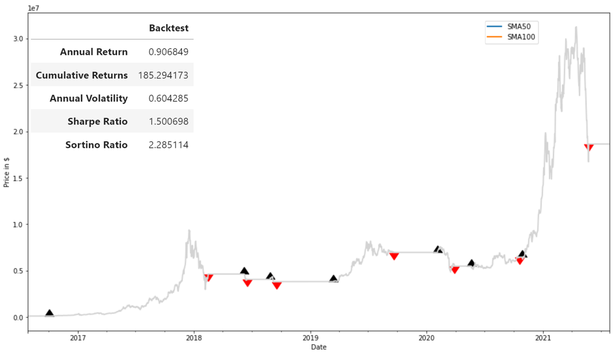
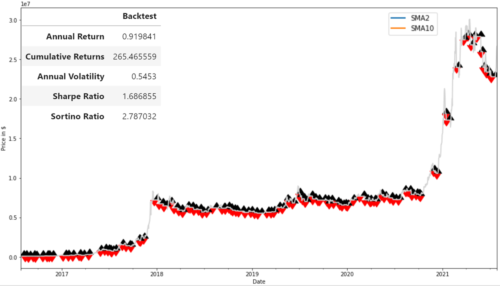
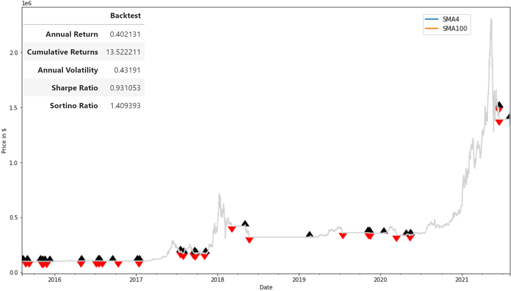

# Algotrading for cryptocurrency long position

If you had an algorithm to monitor and *long* the market from 2015, how much money could you have possibly *made* ? As a long term optimist for the cryptocurrency market, in this project we created a dual moving average crossover strategy that would have longed position of BTC and ETH during the years between 2015 till now.
 
## Methods

* Create a short-term moving average and a long-term moving average from the BTC closing prices using the `rolling` and `mean` functions.

  * Use the numpy `where` function to set the signal column to `1.0` when the SMA50 is greater than SMA100 and `0.0` otherwise.

  * Use the `diff` function on the `Signal` column and assign the values to a `Entry/Exit` column to indicate trade entry and exit points in time.

* Plot the entry and exit points of your Short Dual Moving Average Crossover signal.

  * Create scatter plots for the entry and exit points. Use the color black to indicate the entry points. Use a second scatter plot with red markers to indicate the exit points.

  * Create line plots for the BTC closing prices, the short-term moving average, and the long-term moving average.

  * Create a composite plot that overlays all of the above into a single plot.
  
  * Perform the backtesing using the historical data, then calculate the metrics.
  
* Changing the trading frequency and comparing the profit and portoflio metrics for different trading frequency cases.

  * Case#1: short-term = 50 days; long-term = 100 days

  * Case#2: short-term = 20 days; long-term = 50 days

  * Case#3: short-term = 4 days; long-term = 100 days
  
  * Case#3: short-term = 2 days; long-term = 10 days

- - -

## Results

* It is found the cumulative return are significant higher with higher trading frequencies than with lower trading frequency for BTC. (18500 % with low trading frequency vs. 26800 % with high trading frequency from 2016 till now).The metrics such as sharpe ratio and sortino ratio are also better with higher trading frequencies.

* When performing the higher frequency algotrading to ETH between 2015 and now, the profit is lower than BTC.

